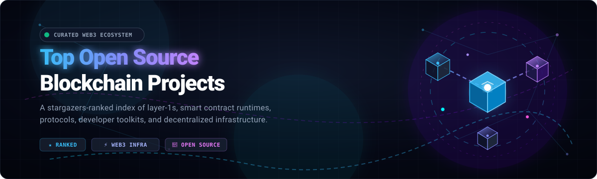

  

# 🌐 Top Open Source Blockchain Projects

  
  
  
  

---

> 🚀 A curated list of the most popular open-source blockchain projects on GitHub, ranked by the number of stargazers.

---

## 🏆 Top Projects

| 🪙 Project | ⭐ Stars | 💻 Main Language(s) | 📝 Description |
|---|---|---|---|
| [Bitcoin](https://github.com/bitcoin/bitcoin) | 87.6k | C++ | ⚡ Bitcoin Core integration/staging tree. |
| [Go Ethereum](https://github.com/ethereum/go-ethereum) | 50.6k | Go | 🦄 Official Go implementation of the Ethereum protocol. |
| [OpenZeppelin Contracts](https://github.com/OpenZeppelin/openzeppelin-contracts) | 27.2k | Solidity | 🛡️ A library for secure smart contract development. |
| [Solidity](https://github.com/ethereum/solidity) | 25.4k | C++ | 📜 The smart contract programming language for Ethereum. |
| [IPFS](https://github.com/ipfs/ipfs) | 23.0k | Go, JavaScript | 📦 A peer-to-peer hypermedia protocol for decentralized storage. |
| [Lenster](https://github.com/lensterxyz/lenster) | 21.2k | TypeScript | 🌿 A decentralized and permissionless social media application built with Lens Protocol. |
| [Web3.js](https://github.com/web3/web3.js) | 19.9k | TypeScript | 🛠️ A collection of comprehensive TypeScript libraries for interaction with the Ethereum JSON RPC API and utility functions. |
| [Diem](https://github.com/diem/diem) | 16.7k | Rust | 💳 Diem’s mission is to build a trusted and innovative financial network. |
| [Hyperledger Fabric](https://github.com/hyperledger/fabric) | 16.5k | Go | 🏢 An enterprise-grade permissioned distributed ledger framework for developing solutions and applications. |
| [Solana](https://github.com/solana-labs/solana) | 14.7k | Rust | ⚡ A web-scale blockchain designed for fast, secure, scalable, decentralized applications and marketplaces. |
| [Truffle](https://github.com/trufflesuite/truffle) | 13.9k | TypeScript | 🍫 A development environment, testing framework, and asset pipeline for Ethereum. |
| [EOS](https://github.com/EOSIO/eos) | 11.2k | C++ | ⛓️ An open-source smart contract platform. |
| [Chia Blockchain](https://github.com/Chia-Network/chia-blockchain) | 10.8k | Python | 🌱 A new blockchain and smart transaction platform that is easier to use, more efficient, and secure. |
| [Foundry](https://github.com/foundry-rs/foundry) | 10.6k | Rust | 🔨 Blazing fast, portable, and modular toolkit for Ethereum application development. |
| [Monero](https://github.com/monero-project/monero) | 10.2k | C++ | 🔒 A secure, private, untraceable cryptocurrency. |
| [Hardhat](https://github.com/NomicFoundation/hardhat) | 8.5k | TypeScript, JavaScript | 👷 Ethereum development environment for professionals. |
| [Substrate](https://github.com/paritytech/substrate) | 8.4k | Rust | 🏗️ Modular framework for building customized blockchains. |
| [Sui](https://github.com/MystenLabs/sui) | 7.7k | Rust | 🌊 High-throughput, low-latency Layer 1 blockchain powered by Move. |
| [Cosmos SDK](https://github.com/cosmos/cosmos-sdk) | 7.1k | Go | 🌌 A framework for building application-specific blockchains in Go. |
| [Aptos Core](https://github.com/aptos-labs/aptos-core) | 6.4k | Rust | 🌐 A Layer 1 blockchain built with safety and user experience in mind. |
| [RustChain](https://github.com/Scottcjn/Rustchain) | 0.1k | Python | 📟 Proof-of-Antiquity blockchain — vintage hardware earns higher mining rewards. Fair launch, on-chain agent economy. |

---

## 💬 Community & Support

- 💬 **[Discord](https://discord.com/invite/jc4xtF58Ve):** Chat with us on Discord for real-time support and discussions.
- 🐦 **[Twitter](https://twitter.com/ishandutta2007):** Follow us on Twitter for the latest news and updates.
- 🐙 **[Github](https://github.com/ishandutta2007):** Follow me on Github for the latest commits and updates.

---

## 💖 Support & Sponsorship

If you find this project helpful or if it has saved you time and resources, please consider sponsoring the development. Your support helps maintain the project, develop new features, and keep the initiative open-source.

👉 **[Sponsor @ishandutta2007 on GitHub](https://github.com/sponsors/ishandutta2007)**

✨ Every contribution, no matter how small, makes a huge difference!

---

##  Star History

